# Projeto `Colonizadores Espaciais`

# Descrição Resumida do Jogo
O jogo é formado por um tabuleiro com 16 planetas e é jogado por duas pessoas.
Existem os itens: nave de guerra, nave colonizadora e satélite e os recursos: metal,
munição e combustível.
O jogo começa com cada jogador em um planeta aleatório, com uma nave colonizadora e
um satélite nele.
A cada rodada, os jogadores têm sua vez e podem optar por se mover para um planeta ou
construir um item (se tiver recursos disponíveis). Se se moverem para um planeta com nave
inimiga, haverá uma luta, sendo a ordem de força satélite>nave de guerra> nave
colonizadora respeitada. Após as jogadas, é sorteado dois planetas, que oferecem os
recursos que possuem para o jogador que está nele. Quanto mais planeta o jogador
colonizar, mais chances tem de ganhar mais recursos.
Ganha o jogador que fizer 12 pontos primeiro (cada item construído
# Equipe
* `Jéssica  Da Silva De Oliveira` - `RA173931`
* `Gabriel Lima Luz` - `RA177836

# Vídeos do Projeto

## Vídeo da Prévia
<iframe width="560" height="315"
src="https://www.youtube.com/watch?v=VSAOGbwekcs"
frameborder="0"
allow="accelerometer; autoplay; encrypted-media; gyroscope; picture-in-picture"
allowfullscreen>
</iframe>

> [<video>](https://drive.google.com/file/d/1sm055svD8BkM5IXoianjSeHf3vuLuPKr/view?usp=sharing)

# Slides do Projeto

## Slides da Prévia
[`Slides`](mediasDoProjeto/ColonizadoresEspaciaisSlides.pdf)

# Documentação dos Componentes

# Diagramas

## Diagrama Geral do Projeto
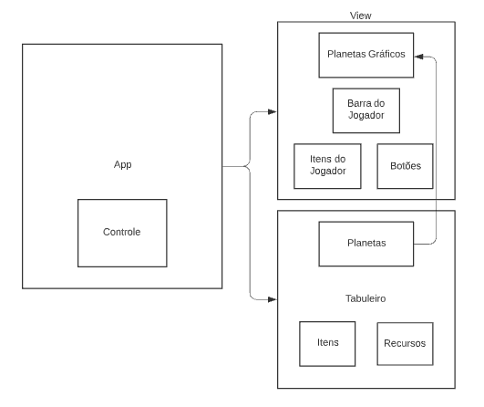
> <Apresente um diagrama geral de organização da organização do seu sistema. O formato é livre. A escolha de um ou mais estilos arquiteturais será considerado um diferencial.>

> <Faça uma breve descrição do diagrama.>

## Diagrama Geral de Componentes

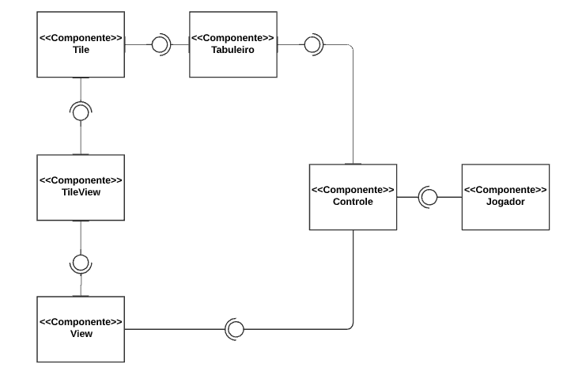
### Componente jogador

Este é o diagrama do componente Jogador:

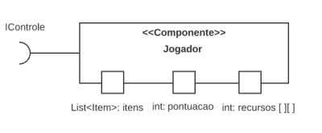

Para cada componente será apresentado um documento conforme o modelo a seguir:

## Componente `Jogador`

>   O Componente Jogador tem como função armazenar a potuação, recursos e itens do jogador
> para que o controle saiba quando o jogo acabou e quais ações são possíveis no turno atual\

**Ficha Técnica**
item | detalhamento
----- | -----
Classe | `<caminho completo da classe com pacotes>`   Exemplo: `pt.c08componentes.s20catalog.s10ds.DataSetComponent`
Autores | `<nome dos membros que criaram o componente>`
Interfaces | `<listagem das interfaces do componente>`

### Interfaces

Interfaces associadas a esse componente:

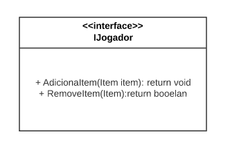

Interface agregadora do componente em Java: ???????

~~~java
public interface IDataSet extends ITableProducer, IDataSetProperties {
}
~~~
## Componente `Controle`

>   O Componente Jogador tem como função armazenar a potuação, recursos e itens do jogador
> para que o controle saiba quando o jogo acabou e quais ações são possíveis no turno atual\
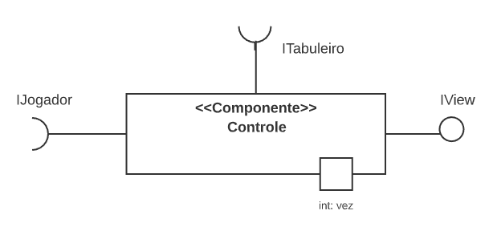

**Ficha Técnica** 
item | detalhamento
----- | -----
Classe | `<caminho completo da classe com pacotes>`   Exemplo: `pt.c08componentes.s20catalog.s10ds.DataSetComponent`
Autores | `<nome dos membros que criaram o componente>`
Interfaces | `<listagem das interfaces do componente>`
???
### Interfaces

Interfaces associadas a esse componente:

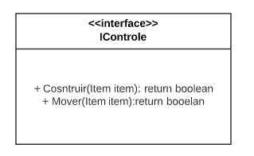

Interface agregadora do componente em Java:
???
~~~java
public interface IDataSet extends ITableProducer, IDataSetProperties {
}
~~~
## Componente `Tabuleiro`

>   O Componente Jogador tem como função armazenar a potuação, recursos e itens do jogador
> para que o controle saiba quando o jogo acabou e quais ações são possíveis no turno atual\
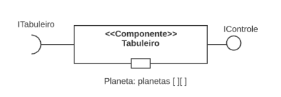

**Ficha Técnica**
item | detalhamento
----- | -----
Classe | `<caminho completo da classe com pacotes>`   Exemplo: `pt.c08componentes.s20catalog.s10ds.DataSetComponent`
Autores | `<nome dos membros que criaram o componente>`
Interfaces | `<listagem das interfaces do componente>`
???
### Interfaces

Interfaces associadas a esse componente:

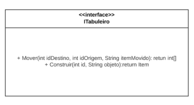

Interface agregadora do componente em Java:
???
~~~java
public interface IDataSet extends ITableProducer, IDataSetProperties {
}
~~~
## Componente `Tile`

>   O Componente Jogador tem como função armazenar a potuação, recursos e itens do jogador
> para que o controle saiba quando o jogo acabou e quais ações são possíveis no turno atual\
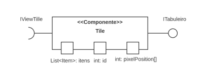

**Ficha Técnica**
item | detalhamento
----- | -----
Classe | `<caminho completo da classe com pacotes>`   Exemplo: `pt.c08componentes.s20catalog.s10ds.DataSetComponent`
Autores | `<nome dos membros que criaram o componente>`
Interfaces | `<listagem das interfaces do componente>`
???
### Interfaces

Interfaces associadas a esse componente:

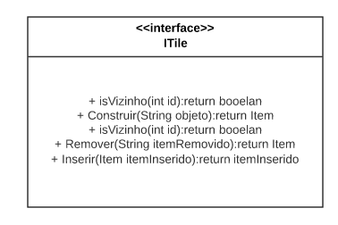

Interface agregadora do componente em Java:
???
~~~java
public interface IDataSet extends ITableProducer, IDataSetProperties {
}
~~~
## Componente `TileView`

>   O Componente Jogador tem como função armazenar a potuação, recursos e itens do jogador
> para que o controle saiba quando o jogo acabou e quais ações são possíveis no turno atual\
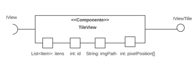

**Ficha Técnica**
item | detalhamento
----- | -----
Classe | `<caminho completo da classe com pacotes>`   Exemplo: `pt.c08componentes.s20catalog.s10ds.DataSetComponent`
Autores | `<nome dos membros que criaram o componente>`
Interfaces | `<listagem das interfaces do componente>`
???
### Interfaces

Interfaces associadas a esse componente:

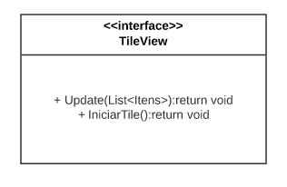

Interface agregadora do componente em Java:
???
~~~java
public interface IDataSet extends ITableProducer, IDataSetProperties {
}
~~~
## Componente `View`

>   O Componente Jogador tem como função armazenar a potuação, recursos e itens do jogador
> para que o controle saiba quando o jogo acabou e quais ações são possíveis no turno atual\
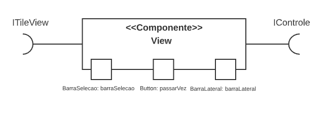

**Ficha Técnica**
item | detalhamento
----- | -----
Classe | `<caminho completo da classe com pacotes>`   Exemplo: `pt.c08componentes.s20catalog.s10ds.DataSetComponent`
Autores | `<nome dos membros que criaram o componente>`
Interfaces | `<listagem das interfaces do componente>`
???
### Interfaces

Interfaces associadas a esse componente:

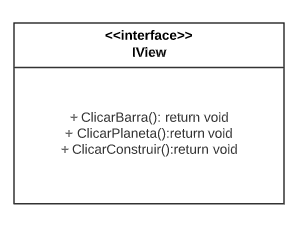

Interface agregadora do componente em Java:
???
~~~java
public interface IDataSet extends ITableProducer, IDataSetProperties {
}
~~~
## Detalhamento das Interfaces

### Interface `<nome da interface>`

`<Resumo do papel da interface.>`

~~~
<Interface em Java.>
~~~

Método | Objetivo
-------| --------
`<id do método em Java>` | `<objetivo do método e descrição dos parâmetros>`

## Exemplo:

### Interface `IItem`

Padronizar e modularizar a comunicação entre as classes Item e Planeta

~~~java
public interface IItem {
    public static List<Recursos> coletados = new ArrayList<Recursos>();
    // acoes de jogo
    int lutar();
    void  recolherRecurso(Recursos coletado);
    // getters e setters
    List<Integer> getPosition();
    List<Recursos> getColetados();
    String getType();
    String getImgPath();
}

~~~

Método | Objetivo
-------| --------
`lutar` | Retorna um int que quando comparado com o valor fornecido por outro item determina quem ganhou a luta.
`recolherRecurso` | !!um pequeno problema!!Recebe um objeto da classe Recursos e adiciona ao atributo estático coletados que armazena todos os recursos coletados pelo jogador .
`continuar a adionar` | mais metodos.
### Interface `IDataSetProperties`

Define o recurso (usualmente o caminho para um arquivo em disco) que é a fonte de dados.

~~~java
public interface IDataSetProperties {
  public String getDataSource();
  public void setDataSource(String dataSource);
}
~~~

Método | Objetivo
-------| --------
`getDataSource` | Retorna o caminho da fonte de dados.
`setDataSource` | Define o caminho da fonte de dados, informado através do parâmetro `dataSource`.

# Plano de Exceções

## Diagrama da hierarquia de exceções
`<Elabore um diagrama com a hierarquia de exceções como detalhado abaixo>`

## Descrição das classes de exceção

`<Monte uma tabela descritiva seguindo o exemplo>:`

Classe | Descrição
----- | -----
DivisaoInvalida | Engloba todas as exceções de divisões não aceitas.
DivisaoInutil | Indica que a divisão por 1 é inútil.
DivisaoNaoInteira | Indica uma divisão não inteira.
